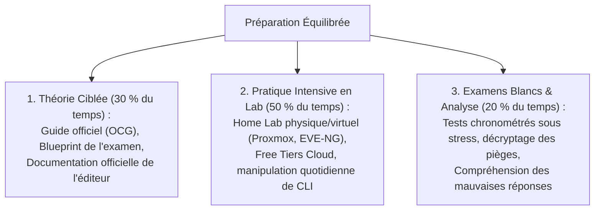

# Méthodologie de Préparation aux Examens de Certification, Home Labs et Gestion du Stress

Réussir une certification IT exige bien plus qu'une simple mémorisation passive : cela nécessite une **stratégie d'ingénierie d'apprentissage éprouvée**, combinant théorie ciblée, pratique intensive en laboratoire et entraînement en conditions réelles.

---

## 1. La Triade Gagnante de Préparation



---

## 2. L'Indispensable Rétroplanning de Révision (Exemple sur 8 Semaines)

```text
┌─────────────────────────────────────────────────────────────┐
│             PLANNING DE RÉVISION : OBJECTIF CCNA / AZ-104   │
├─────────────────────────────────────────────────────────────┤
│ Semaines 1 à 4 : Couverture théorique bloc par bloc + Labs  │
│ Semaine 5 & 6  : Labs d'intégration complexes de synthèse   │
│ Semaine 7      : 1ers examens blancs chronométrés + revue   │
│ Semaine 8      : 2nds examens blancs (cible >= 85 %) + repos│
│ JOUR J         : Passage de l'examen en centre de test      │
└─────────────────────────────────────────────────────────────┘
```

---

## 3. Modalités de Passage : Centre Physique vs Online Proctoring

- **En centre d'examen agréé (Pearson VUE / Kryterion)** :
  - *Avantages* : Environnement calme, matériel standardisé garanti, pas de risque de déconnexion réseau domestique.
  - *Contraintes* : Déplacement physique requis, réservation à date fixe.
- **En ligne surveillé par webcam (_Online Proctoring_)** :
  - *Avantages* : Passage depuis son domicile 24h/24.
  - *Règles draconiennes* : Pièce totalement isolée, bureau nu sans papier/stylo, interdiction stricte de parler ou de détourner le regard de l'écran sous peine d'annulation immédiate sans remboursement.

---

## 4. Gestion du Temps et Décryptage des Questions

1. **Calcul du temps par question** : $\frac{90\text{ minutes}}{60\text{ questions}} = 1\text{ minute } 30\text{ secondes}$ par question.
2. **Repérage des mots clés discriminateurs** :
   - « *What is the **MOST** cost-effective solution?* » (Plusieurs réponses fonctionnent techniquement, mais une seule minimise le coût).
   - « *Which protocol is **NOT** supported?* »
   - « *What is the **FIRST** step in troubleshooting?* »
