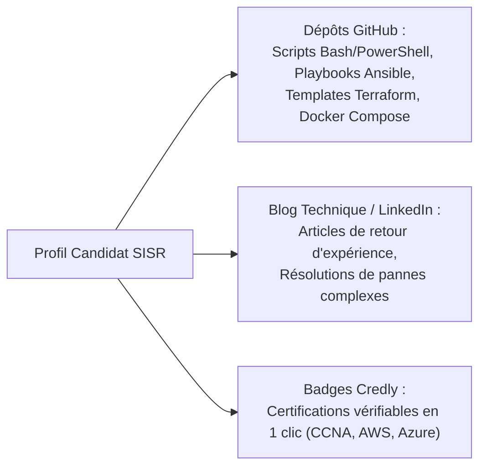

# Portfolio Technique, Visibilité Professionnelle, GitHub et Preuves de Compétences

Dans le secteur de l'infrastructure et de la cybersécurité, **montrer ce que l'on sait faire vaut mille déclarations d'intention**. Un portfolio technique bien documenté transforme un CV classique en une démonstration d'expertise indiscutable.

---

## 1. L'Écosystème du Portfolio Moderne pour un Profil SISR



---

## 2. Anatomie d'un Dépôt GitHub Exemplaire

Un recruteur ou un jury d'examen (épreuve E4/E5) juge la rigueur d'un candidat à la qualité de son dépôt :

```text
mon-projet-infra/
├── .github/workflows/ci.yml     # Pipeline de test automatique
├── ansible/                     # Rôles et playbooks de configuration
├── terraform/                   # Manifestes d'infrastructure as code
├── docs/
│   └── architecture-diagram.png # Schéma réseau & flux
├── LICENSE                      # Licence open-source (ex: MIT, GPL-3.0)
└── README.md                    # Vitrine indispensable du projet
```

### Contenu indispensable du `README.md` :
1. **Titre & Contexte métier** : Problème d'entreprise que le projet résout.
2. **Schéma d'architecture visuel** : Topologie réseau, flux de données ou diagramme de conteneurs.
3. **Prérequis & Technologies utilisées** : Versions de Linux, Docker, Ansible.
4. **Guide de déploiement rapide** : Commandes à copier-coller pour tester en 5 minutes.
5. **Gestion de la sécurité & Bonnes pratiques** : Absence de secrets commités, variables d'environnement documentées.

---

## 3. Valorisation des Badges Numériques Vérifiables

- Les organismes officiels (Cisco, Microsoft, AWS, CompTIA, LPI) délivrent leurs certificats via la plateforme **Credly**.
- Chaque badge possède une URL unique contenant les métadonnées de délivrance, le score et la date d'expiration, permettant au recruteur de vérifier l'authenticité du titre sans risque de fraude.
