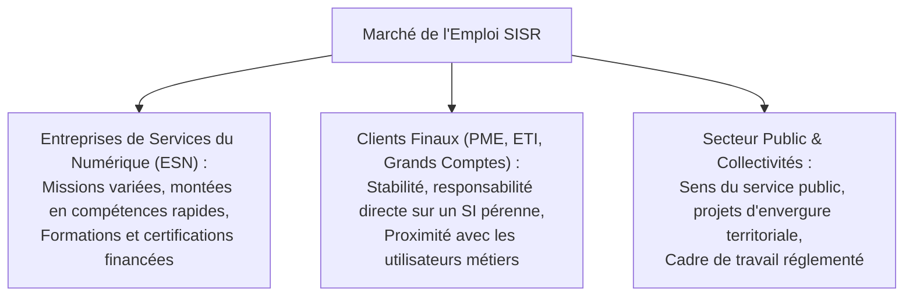

# Insertion Professionnelle, Stratégies d'Entretien, CV Technique et Évolutions de Carrière SISR

L'obtention du diplôme BTS SIO SISR couplée à des réalisations techniques concrètes ouvre les portes d'un marché de l'emploi IT très dynamique en France et en Europe.

---

## 1. Panorama des Typologies d'Employeurs



---

## 2. La Méthode STAR pour Briller en Entretien RH et Technique

Pour répondre de manière convaincante aux questions comportementales et techniques :

| Lettre | Étape | Exemple pour un incident d'infrastructure |
|---|---|---|
| **S** | **Situation** | « Lors de mon stage, le serveur Active Directory principal est tombé en panne un lundi matin. » |
| **T** | **Tâche** | « Ma mission était de restaurer l'authentification des 150 collaborateurs sans perte de données. » |
| **A** | **Action** | « J'ai vérifié les logs d'événements, forcé le basculement FSMO sur le contrôleur secondaire et restauré la sauvegarde système via Veeam. » |
| **R** | **Résultat** | « Le service a été rétabli en 25 minutes et j'ai documenté la procédure de secours pour l'équipe. » |

---

## 3. Diagnostic lors de l'Entretien Technique

Face à une question de dépannage (*« Le serveur Web ne répond plus, que faites-vous ? »*), le recruteur évalue la **rigueur méthodologique** :

```text
┌─────────────────────────────────────────────────────────────┐
│             DÉMARCHE DE DIAGNOSTIC EN COUCHES               │
├─────────────────────────────────────────────────────────────┤
│ 1. Couche Physique & Câblage (Lien UP / LEDs)               │
│ 2. Couche Réseau (Ping passerelle, IP valide, Routage)      │
│ 3. Couche Transport (Port TCP 80/443 ouvert, Netstat/SS)    │
│ 4. Couche Système & Processus (Systemctl status, CPU/RAM)   │
│ 5. Couche Journaux & Erreurs (Journalctl, Nginx error.log)  │
└─────────────────────────────────────────────────────────────┘
```

---

## 4. Trajectoires d'Évolution Professionnelle

```text
Technicien Support N2 / Administrateur Systèmes Junior (Sortie BTS SIO)
      │
      ├──► Administrateur Systèmes & Réseaux Senior
      │          └──► Responsable d'Infrastructure / DSI
      │
      ├──► Ingénieur Cloud & DevOps (AWS, Azure, Terraform, Kubernetes)
      │          └──► Architecte Cloud Solutions
      │
      └──► Analyste SOC / Consultant Sécurité Opérationnelle (SecOps)
                 └──► Responsable de la Sécurité des Systèmes d'Information (RSSI)
```
