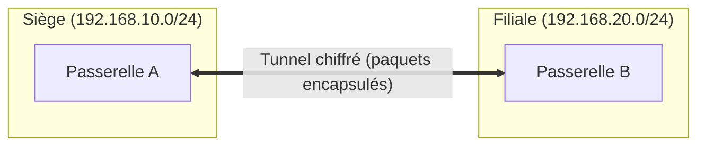

# Concepts VPN : Tunneling, Chiffrement et Familles de Protocoles

Un **VPN** (*Virtual Private Network*) construit un réseau privé logique par-dessus une infrastructure non sûre (Internet). Il repose sur trois services cryptographiques : **confidentialité** (chiffrement), **intégrité** (HMAC) et **authentification** mutuelle des extrémités.

---

## 1. Tunneling et encapsulation



L'encapsulation consiste à prendre un paquet IP **complet** (en-têtes compris), le chiffrer, puis l'envelopper dans un nouveau paquet routé entre les deux extrémités du tunnel. Deux modes structurels :

- **Tunnel mode** : tout le paquet est protégé et re-émetté entre deux passerelles (ou un client) ; les sous-réseaux internes se joignent comme sur un même LAN ;
- **Transport mode** : seule la charge utile est protégée, entre deux hôtes bout à bout.

> **Vocabulaire SISR** : le *nat traversal* (NAT-T, UDP 4500) permet au tunnel de survivre à la NAT des box et routeurs — sans lui, la plupart des tunnels traversent mal un NAT.

## 2. Confidentialité, intégrité et authentification

| Service | Mécanisme | Exemple |
|---|---|---|
| Confidentialité | Chiffrement symétrique | AES-256-GCM, ChaCha20-Poly1305 |
| Intégrité | HMAC / AEAD (tag intégré) | HMAC-SHA-384, Poly1305 |
| Authentification | Certificats X.509 / clés publiques / PSK | CA d'entreprise (leçon 5 du module serveurs-web) |
| Anti-rejeu | Numéros de séquence + fenêtre glissante | Compteurs IPsec |

> **AEAD** (*Authenticated Encryption with Associated Data*) combine chiffrement et intégrité en une opération : AES-GCM et ChaCha20-Poly1305 rendent le HMAC séparé inutile. WireGuard n'admet **que** des suites AEAD, éliminant par construction les configurations faibles.

---

## 3. Les familles de protocoles VPN

| Famille | Couche | Points forts | Limites | Usage typique |
|---|---|---|---|---|
| **IPsec** | IP (couche 3) | Standard interopérable, site-à-site multi-constructeurs | Configuration complexe (IKE), traversal NAT délicate | Interconnexion de sites |
| **OpenVPN (SSL/TLS)** | Application, sur TCP/UDP | Robuste derrière toute NAT, certificats X.509, MFA | Performances en espace utilisateur, MTU à surveiller | Accès nomades |
| **WireGuard** | Interface noyau | Code minimal (~4 000 lignes), très rapide, cryptographie moderne imposée | Jeune, pas de gestion d'identité native (clés statiques) | Site-à-site et nomades récents |
| L2TP/IPsec, PPTP | Variants | Compatibilité ancienne | PPTP **cassé** ; L2TP double encapsulation | Legacy uniquement |

- **IPsec** se décompose en IKE (négociation) + ESP (protection des données) — détaillé dans la leçon suivante ;
- **OpenVPN** s'appuie sur TLS pour négocier, puis fait circuler un tunnel UDP 1194 avec des données chiffrées par OpenSSL ;
- **WireGuard** utilise le protocole de bruit *Noise IK* : la poignée de main tient en 1 aller-retour, sans négociation de suites (aucune « mauvaise configuration » possible).

```text
Comparaison indicative (poignée de main + débit) :
WireGuard   : connexion < 50 ms, throughput proche du lien physique
OpenVPN UDP : négociation TLS ~200-400 ms, overhead espace utilisateur
IPsec IKEv2 : négociation ~300-600 ms, très bon débit noyau
```

## 4. Site-à-site vs nomade

- **Site-à-site** : deux passerelles établissent le tunnel en permanence ; les postes des deux sites n'ont **aucun logiciel** à installer — le routage fait le travail ;
- **Nomade** (road-warrior) : le collaborateur lance un client VPN depuis n'importe où ; l'authentification porte sur l'**utilisateur** (certificat + MFA), pas seulement la machine ;
- **Accès distant d'administration** : accès des administrateurs à l'infrastructure (distinct de l'accès des utilisateurs — périmètre et habilitations séparés, principe du moindre privilège).

---

## Points clés

1. Un VPN délivre **confidentialité + intégrité + authentification** ; sans les trois, il n'est pas exploitable en entreprise.
2. **Tunnel mode** pour joindre des réseaux, **transport mode** pour protéger un flux entre deux hôtes.
3. Privilégier les suites **AEAD** (AES-GCM, ChaCha20-Poly1305) — elles rendent les erreurs de configuration cryptographique quasi impossibles.
4. IPsec = interopérable et multi-sites ; OpenVPN = robuste derrière les NAT ; WireGuard = rapide et minimaliste.