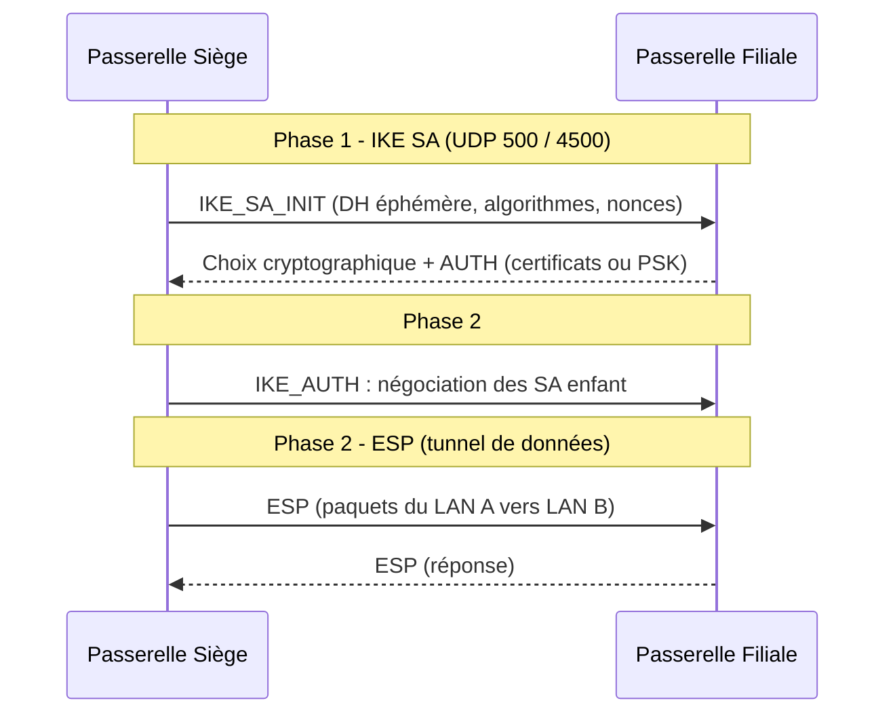

# VPN Site-à-Site avec IPsec

IPsec est la norme de référence pour relier deux sites : interopérable entre constructeurs (Cisco, pfSense, strongSwan...), négociée par **IKE** et appliquée par **ESP**. C'est le VPN le plus exigeant en configuration — d'où l'importance de comprendre ses deux phases avant de toucher un équipement.

---

## 1. Architecture d'IPsec : IKE puis ESP



- **Phase 1 — IKE_SA** : les passerelles s'authentifient (certificats X.509 recommandé, ou PSK), établissent un canal chiffré via Diffie-Hellman éphémère ;
- **Phase 2 — CHILD_SA (ESP)** : négociation des politiques de trafic (les *traffic selectors* : quels sous-réseaux passer dans le tunnel) puis protection effective des paquets ;
- **Rekeying** : les SA sont renouvelées périodiquement (par exemple toutes les 8 h / 2^32 octets) — une clé longue durée n'est jamais utilisée pour chiffrer tout le flux.

## 2. AH vs ESP, tunnel vs transport

| Protocole | Chiffre ? | Protège les en-têtes IP ? | Usage |
|---|---|---|---|
| **AH** (51) | Non (intégrité seule) | Oui, y compris les champs immuables | Legacy, inutilisable derrière NAT |
| **ESP** (50) | Oui (confidentialité + intégrité) | En tunnel mode, le paquet entier est encapsulé | **Standard de facto** |

**En pratique, ESP en mode tunnel** : compatible NAT-T (encapsulation UDP 4500), compatible IPv4/IPv6, et le chiffrement est souhaitable. AH est quasi réservé aux architectures très spécifiques sans NAT.

---

## 3. Configuration site-à-site avec strongSwan

```bash
# /etc/ipsec.conf — passerelle Siège (192.168.10.0/24) vers filiale
config setup
    strictcrlpolicy=yes
    uniqueids = no

conn siège-filiale
    type=tunnel
    auto=start
    keyexchange=ikev2
    left=203.0.113.10
    leftsubnet=192.168.10.0/24
    leftcert=gw-siege.crt
    right=198.51.100.20
    rightsubnet=192.168.20.0/24
    ike=aes256gcm16-prfsha384-ecp384!     # phase 1 verrouillée
    esp=aes256gcm16-ecp384!               # phase 2 AEAD uniquement
    dpdaction=restart
    dpddelay=30s
```

```bash
# Diagnostic strongSwan
ipsec statusall                 # état des SA (IKE + CHILD), compteurs ESP
swanctl --list-sas              # tunnels actifs et traffic selectors
journalctl -u strongswan -f     # négociation pas à pas
```

**Cause n°1 d'échec** : les *traffic selectors* `leftsubnet`/`rightsubnet` asymétriques ou une proposition IKE/ESP qui ne coïncide pas entre les deux extrémités (l'`!` final interdit tout repli — verrouillage volontaire).

## 4. Checklist de déploiement site-à-site

1. Ouverture pare-feu : **UDP 500** et **4500** entre passerelles ;
2. Autorisation du protocole **ESP (50)** hors NAT-T ;
3. `leftid`/`rightid` cohérents avec les certificats (SAN du module serveurs-web-pki-tls) ;
4. Routes statiques ou politiques de sécurité pour orienter le LAN vers le tunnel ;
5. Suppression du NAT entre sites (pas de masquerade sur le flux tunnel) ;
6. Supervision : alerte si `CHILD_SA` tombe (voir module supervision-observabilite).

---

## Points clés

1. **Phase 1 = confiance** (IKE_SA), **phase 2 = données** (ESP/CHILD_SA) — diagnostiquer dans cet ordre.
2. ESP **tunnel mode** + NAT-T (UDP 4500) est la combinaison à retenir ; AH est à éviter.
3. Verrouiller IKE et ESP avec l'opérateur `!` : refuser tout algorithme non négocié explicitement.
4. Certificats X.509 plutôt que PSK pour l'authentification des passerelles.