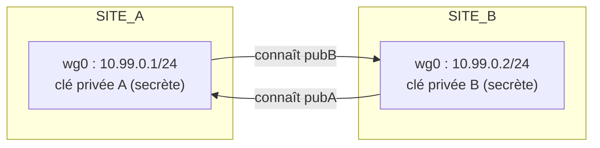

# WireGuard : Le VPN Moderne

WireGuard réinvente le VPN avec une philosophie radicale : **4 000 lignes de code** (contre des centaines de milliers pour OpenVPN/IPsec), une cryptographie **fixe et moderne** (Curve25519, ChaCha20-Poly1305, BLAKE2s), et une configuration de quelques lignes. Intégré au noyau Linux depuis la version 5.6, il est devenu le choix de référence pour les tunnels site-à-site et les accès nomades récents.

---

## 1. Le modèle de confiance : des paires de clés

Chaque extrémité possède une paire de clés Curve25519. **La clé publique de chaque pair est déclarée chez l'autre** — pas de CA, pas de certificats : la table des pairs *est* la politique de confiance.



```bash
# Génération des paires de clés (chaque machine génère la sienne)
wg genkey | tee privatekey | wg pubkey > publickey
```

> **Sécurité** : la clé privée est tout ou rien — un fichier `privatekey` en 0600, jamais dans Git. Une clé compromise se remplace en régénérant la paire et en mettant à jour le peer distant.

---

## 2. Anatomie d'une configuration WireGuard

```ini
# /etc/wireguard/wg0.conf — passerelle du siège
[Interface]
Address = 10.99.0.1/24          # sous-réseau de tunnel
ListenPort = 51820
PrivateKey = <clé privée A>

[Peer]                          # passerelle filiale
PublicKey = <clé publique B>
Endpoint = 198.51.100.20:51820  # adresse publique du pair
AllowedIPs = 10.99.0.2/32, 192.168.20.0/24
PersistentKeepalive = 25
```

### AllowedIPs fait deux métiers à la fois

1. **Routage sortant** : les paquets destinés à ces réseaux sont injectés dans l'interface `wg0` (comme une route `ip route`) ;
2. **Filtre entrant + identité** : un paquet reçu d'un peer ne sera accepté que si sa source appartient à ses `AllowedIPs` — toute autre source est rejetée (anti-usurpation intégré).

> **Piège n°1** : des `AllowedIPs` qui se chevauchent entre deux peers — le premier peer déclaré gagne le routage. **Piège n°2** : pour un client nomade qui veut tout router (`full tunnel`), `AllowedIPs = 0.0.0.0/0` et l'on gère le DNS et le routage par défaut avec des règles dédiées.

### Activation et exploitation

```bash
systemctl enable --now wg-quick@wg0     # service persistant
wg show                                  # poignées de main, compteurs, latence
ping 10.99.0.2                           # test de bout en bout du tunnel
```

## 3. PersistentKeepalive et NAT

WireGuard n'émet **rien** tant qu'aucun trafic ne circule ; or un NAT oublie une correspondance UDP inactive au bout de quelques dizaines de secondes. `PersistentKeepalive = 25` maintient la session NAT ouverte côté client uniquement (le serveur, exposé publiquement, n'en a pas besoin).

---

## Points clés

1. La table des **pairs (clés publiques)** constitue l'unique politique de confiance.
2. `AllowedIPs` = routage **et** anti-usurpation : c'est le réglage le plus décisif.
3. `PersistentKeepalive` se met côté **client derrière NAT**, pas côté serveur.
4. `wg show` est l'outil de diagnostic premier (`latest handshake`, `transfer`, `endpoint`).