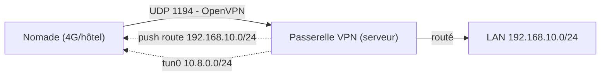

# VPN Nomade avec OpenVPN

OpenVPN reste la solution nomade la plus répandue en entreprise : disponibilité multiplateforme, authentification par **certificats X.509** (issus de la PKI, leçon 5 du module serveurs-web-pki-tls), second facteur possible et traversée des NAT fiable en UDP comme en TCP. Il fonctionne en **espace utilisateur** : installation simple, performance très correcte pour le télétravail.

---

## 1. Architecture client-serveur en mode routé



- Le serveur crée une interface virtuelle **`tun0`** et attribue aux clients des adresses du sous-réseau VPN (`server 10.8.0.0 255.255.255.0`) ;
- Le mode **`tun`** (routé, IP) est le standard ; le mode `tap` (ponté, niveau 2) est réservé aux cas qui exigent des broadcasts du LAN ;
- L'**ip_forward** et une règle NAT/FIREWALL adaptée permettent aux clients de joindre les ressources internes.

---

## 2. Configuration serveur durcie

```bash
# /etc/openvpn/server/server.conf — extraits essentiels
port 1194
proto udp
dev tun
server 10.8.0.0 255.255.255.0          # sous-réseau VPN

# PKI (leçon 5 - serveurs-web-pki-tls)
ca   /etc/openvpn/pki/ca-racine.pem
cert /etc/openvpn/pki/vpn-server.crt
key  /etc/openvpn/pki/vpn-server.key   # 0600
dh   none
tls-crypt /etc/openvpn/pki/ta.key      # masque le canal de contrôle

# Chiffrement moderne (TLS 1.2+ obligatoire)
tls-version-min 1.2
data-ciphers AES-256-GCM:AES-128-GCM:CHACHA20-POLY1305
auth SHA256

# Routage et services poussés
push "route 192.168.10.0 255.255.255.0"
push "dhcp-option DNS 192.168.10.5"

# Durcissement utilisateurs
user nobody
group nogroup
persist-key
persist-tun
compress                # ou lz4-v2
verb 3
log-append /var/log/openvpn/server.log
```

> **`tls-crypt`** (plutôt que `tls-auth`) chiffre le canal de contrôle : les poignées de main ne sont plus visibles sur Internet, ce qui complique la reconnaissance passive.

### Profils clients .ovpn sécures

Un profil `.ovpn` embarque ca/cert/key (format `<ca>...</ca>` inline). Règles : une clé/certificat **par utilisateur**, révoquables individuellement (`crl-verify`), phrase secrète sur la clé, distribution par canal authentifié (jamais par email en clair).

## 3. Second facteur et filtrage post-connexion

- **MFA** : certificat (facteur 1 : ce que je possède) **+** code TOTP ou OTP côté RADIUS/PAM (facteur 2). OpenVPN s'interface avec PAM (`plugin pam`) ou un RADIUS/IdP ;
- **Filtrage par groupe** : les postes administrateurs joignent la VLAN admin, les utilisateurs standard uniquement les services — via `client-config-dir` et `learn-address` ;
- **Journalisation** : connexions, adresses attribuées (`server.log`), rejeu dans le SIEM (module supervision-observabilite) ;
- **Durcissement du poste client** : correctifs à jour, EDR, chiffrement disque (le VPN n'a jamais protégé un poste volé ouvert).

## 4. Plan de réponse à incident VPN

1. Révoquer le certificat client compromis (régénérer la CRL, `crl-verify` la fait appliquer immédiatement) ;
2. Couper la session active (`management interface` / kick client) ;
3. Analyser les logs : `client-connect`, sources, ressources touchées ;
4. Élargir : vérifier les autres sessions du même utilisateur.

---

## Points clés

1. **`tun` routé + certificats + tls-crypt + AES-GCM** = configuration de référence 2026.
2. Un profil `.ovpn` = une identité : révocable individuellement, jamais partagée.
3. Full-tunnel pour l'administration, split-tunneling documenté pour le télétravail standard.
4. La MFA transforme un certificat volé en simple fichier inopérant sans le second facteur.