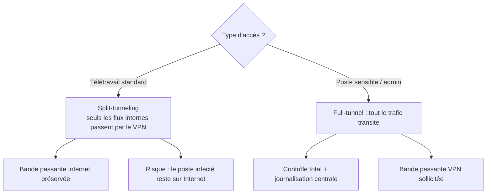

# Sécurisation des Accès Distants

Le VPN est une **porte d'entrée** : mal sécurisé, il transforme un poste personnel compromis en pivot vers tout le SI. Cette leçon couvre les mesures qui font la différence entre un accès distant maîtrisé et un boulevard.

---

## 1. Arbitrage full-tunnel vs split-tunneling



- **Split-tunneling** (`push route 192.168.10.0/24` ou `AllowedIPs` limités) : seuls les flux vers l'entreprise transitent par le tunnel ;
- **Full-tunneling** (`AllowedIPs = 0.0.0.0/0` ou redirect-gateway) : tout le trafic est inspecté et journalisé au niveau de l'entreprise — indispensable pour les postes d'administration ;
- **Kill switch** : en cas de chute du tunnel, le poste doit couper son trafic (firewall local « block non-VPN traffic ») pour ne jamais basculer silencieusement en clair.

---

## 2. Renforcer l'authentification

| Mesure | Effet | Coût |
|---|---|---|
| Certificats par utilisateur (PKI) | Révocation individuelle immédiate | Gestion de la CA |
| MFA (TOTP/FIDO2) | Le vol de certificat seul ne suffit plus | Plugin PAM / IdP |
| Comptes nominatifs + traçabilité | Attribution des actions | Journalisation |
| Interdiction des PSK partagées | Pas d'identité nominative, pas de révocation fine | — |

> **Règle ANSSI** : pour l'accès à distance administrateur, exiger **deux facteurs indépendants** et rejouer l'authentification à chaque nouvelle session. Le module `d1-roles-admin` d'OpenSIO applique le même principe côté applicatif.

## 3. Réduire la surface exposée

```bash
# Exemple : le portail VPN n'expose QUE 443 UDP/QUIC et rejette le reste
iptables -A INPUT -p udp --dport 51820 -j ACCEPT
iptables -A INPUT -i wg0 -s 10.99.0.0/24 -d 192.168.10.5 --dport 22 -j ACCEPT
iptables -A INPUT -i wg0 -j DROP          # le VPN ne voit que ce qui est explicitement permis
```

1. Restreindre l'**accès VPN aux seuls flux métier** (pas d'accès SSH généralisé depuis le tunnel) ;
2. Séparer les **profils admin** et **profils utilisateurs** (VLAN, ACL, horaires) ;
3. Fixer des **TTL de session** courts avec reconnexion authentifiée ;
4. Superviser les anomalies : poignées de main nocturnes, sources géographiques inattendues, échecs répétés (voir `detection-intrusions-et-logs` du module securite-systemes-durcissement).

## 4. Le poste client, maillon faible

Le tunnel est solide ; l'extrémité ne l'est pas toujours : poste non patché, cache DNS empoisonné (forcer les serveurs DNS internes via `push dhcp-option DNS`), antivirus absent, session utilisateur non verrouillée. Intégrer les postes distants aux mêmes politiques que le siège (GPO/MDM, correctifs, verrouillage automatique).

---

## Points clés

1. Le VPN est une porte, pas une forteresse : **filtrer derrière le tunnel** comme à l'entrée.
2. Full-tunnel pour l'administration, split-tunneling documenté pour l'usage standard.
3. **MFA obligatoire** sur tout accès distant ; certificats révocables individuellement.
4. Kill switch + DNS interne poussé = aucune fuite silencieuse hors tunnel.