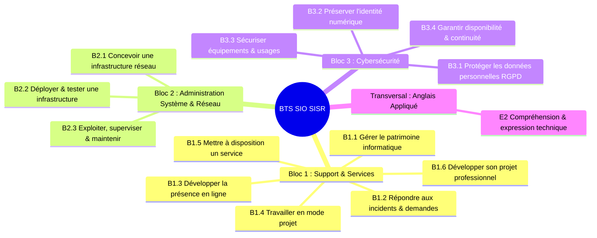
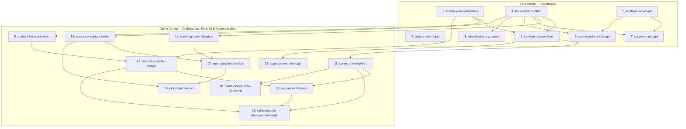

# 🗺️ Cartographie des Modules Pédagogiques BTS SIO SISR — OpenSIO

> **Document de référence pour le Lot D3**  
> Ce document définit la cartographie complète des modules pédagogiques d'OpenSIO pour l'ensemble du cycle de formation **BTS Services Informatiques aux Organisations (option SISR)**, répartis sur les deux années d'études, alignés sur les blocs de compétences officiels du référentiel national, et ordonnancés selon leurs dépendances pédagogiques.

---

## 📌 1. Référentiel de Compétences BTS SIO SISR

Les contenus pédagogiques d'OpenSIO s'alignent directement sur le **référentiel officiel du BTS SIO (Arrêté du 28 février 2019)** et couvrent les 3 blocs de compétences professionnelles ainsi que l'épreuve de langue vivante appliquée :

### Nomenclature des codes de compétences :

| Code | Intitulé officiel du Référentiel BTS SIO |
|---|---|
| **B1.1** | Gérer le patrimoine informatique (recensement, habilitations, sauvegardes, continuité) |
| **B1.2** | Répondre aux incidents et aux demandes d'assistance et d'évolution |
| **B1.3** | Développer la présence en ligne de l'organisation |
| **B1.4** | Travailler en mode projet (objectifs, planification, suivi) |
| **B1.5** | Mettre à disposition des utilisateurs un service informatique (recette, déploiement, accompagnement) |
| **B1.6** | Organiser son développement professionnel (veille technologique, environnement d'apprentissage) |
| **B2.1** | Concevoir une solution d'infrastructure réseau (besoin, architecture, adressage IP) |
| **B2.2** | Installer, tester et déployer une solution d'infrastructure réseau (interconnexion, services DNS/DHCP/routage) |
| **B2.3** | Exploiter, superviser et maintenir une solution d'infrastructure réseau (Linux, Windows, AD, maintenance) |
| **B3.1** | Protéger les données à caractère personnel (RGPD, chiffrement des données, gestion des accès) |
| **B3.2** | Préserver l'identité numérique de l'organisation (certificats PKI/TLS, accès distants, authentification forte) |
| **B3.3** | Sécuriser les équipements et les usages d'un système d'information (pare-feu, durcissement, segmentation) |
| **B3.4** | Garantir la disponibilité des services et la continuité d'activité (haute disponibilité, PRA/PCA, gestion de crise) |
| **E2** | Expression et communication en langue anglaise technique (RFC, man pages, tickets d'incident, logs) |

---

## 📊 2. État des Lieux du Contenu OpenSIO

Actuellement, la plateforme dispose du parcours **1ère année (`annee-1`)** complet avec ses **8 modules opérationnels**, validés à 100 % par `@opensio/content-schema` et `content/validate.mjs` :

- **8 modules complétés** : `reseaux-fondamentaux`, `windows-server-ad`, `linux-administration`, `services-reseau-linux`, `virtualisation-systemes`, `sauvegardes-stockage`, `support-parc-glpi`, `anglais-technique`.
- **Total opérationnel 1ère année** : 44 leçons, 44 quiz (232 questions), 20 labs pratiques autonomes (63 tests validateurs).
- **Parcours 2ème année (`annee-2`)** : initialisé avec son fichier `track.yaml` et son premier module placeholder `routage-interconnexion`.

---

## 🗂️ 3. Cartographie Globale des Modules

La cartographie complète comporte **19 modules** (8 en 1ère année, 11 en 2ème année) couvrant l'intégralité du cursus BTS SIO SISR :

### 3.1. Parcours 1ère Année (`annee-1`) — Fondations & Administration de Base

| # | Slug proposé | Titre du module | Statut | Leçons cibles | Labs cibles | Blocs couverts |
|---|---|---|---|:---:|:---:|---|
| 1 | `reseaux-fondamentaux` | Réseaux : fondamentaux | **Complet** | 7 | 4 | B2.1, B2.2 |
| 2 | `windows-server-ad` | Windows Server & Active Directory | **Complet** | 6 | 3 | B1.1, B1.2, B2.1, B2.3 |
| 3 | `linux-administration` | Linux : administration système & services de base | **Complet** | 6 | 3 | B1.1, B1.2, B2.3 |
| 4 | `services-reseau-linux` | Services réseau Linux (DNS, DHCP, NTP) | **Complet** | 5 | 2 | B2.1, B2.2, B2.3 |
| 5 | `virtualisation-systemes` | Virtualisation & Hyperviseurs (Type 1 & Type 2) | **Complet** | 5 | 2 | B1.1, B1.5, B2.3 |
| 6 | `sauvegardes-stockage` | Stockage, Sauvegardes & Continuité d'activité | **Complet** | 5 | 2 | B1.1, B2.3, B3.4 |
| 7 | `support-parc-glpi` | Gestion de parc & Gestion des incidents (ITIL / GLPI) | **Complet** | 5 | 2 | B1.1, B1.2, B1.5 |
| 8 | `anglais-technique` | Anglais technique pour les systèmes et réseaux | **Complet** | 5 | 2 | E2, B1.2, B2.1 |

### 3.2. Parcours 2ème Année (`annee-2`) — Spécialisation, Sécurité, DevOps & Cloud

| # | Slug proposé | Titre du module | Statut | Leçons cibles | Labs cibles | Blocs couverts |
|---|---|---|---|:---:|:---:|---|
| 9 | `routage-interconnexion` | Routage dynamique & Interconnexion de réseaux | **À créer** | 5 | 2 | B2.1, B2.2 |
| 10 | `securite-pare-feu-filtrage` | Sécurité périmétrique, Pare-feu & Filtrage réseau | **À créer** | 6 | 3 | B2.2, B3.3, B3.4 |
| 11 | `serveurs-web-pki-tls` | Services Web, Reverse Proxy & Infrastructure PKI / TLS | **À créer** | 6 | 3 | B2.3, B3.2, B3.3 |
| 12 | `vpn-acces-distants` | Réseaux privés virtuels (VPN) & Accès distants sécurisés | **À créer** | 5 | 2 | B2.1, B2.2, B3.2, B3.3 |
| 13 | `conteneurisation-docker` | Conteneurisation d'applications avec Docker & Compose | **À créer** | 6 | 3 | B1.5, B2.3, B3.3 |
| 14 | `scripting-automatisation` | Scripting système & Automatisation (Bash & PowerShell) | **À créer** | 6 | 2 | B1.1, B2.3 |
| 15 | `supervision-metrologie` | Supervision des infrastructures, Métrologie & Alerting | **À créer** | 5 | 2 | B1.2, B2.3, B3.4 |
| 16 | `cybersecurite-durcissement-audit` | Cybersécurité : Durcissement, Audit & Gestion des vulnérabilités | **À créer** | 6 | 3 | B3.1, B3.2, B3.3, B3.4 |
| 17 | `automatisation-ansible` | Gestion de configuration & Déploiement avec Ansible | **À créer** | 5 | 2 | B1.5, B2.3, B3.3 |
| 18 | `haute-disponibilite-clustering` | Haute disponibilité, Équilibrage de charge & Continuité de service | **À créer** | 5 | 2 | B2.1, B2.3, B3.4 |
| 19 | `cloud-hybride-cicd` | Cloud hybride & Intégration / Déploiement Continus (CI/CD) | **À créer** | 5 | 2 | B1.4, B1.5, B2.1, B2.3 |

---

## 🔍 4. Fiches Détaillées des Modules

### 4.1. Modules de 1ère Année

#### 1. `reseaux-fondamentaux` (Existant)
- **Année** : 1 | **Difficulté** : 2 | **Durée** : 600 min | **Statut** : Existant
- **Compétences** : `B2.1`, `B2.2`
- **Leçons (7)** : `01-adressage-ipv4`, `02-modeles-osi-tcpip`, `03-subnetting-vlsm`, `04-ipv6-essentiels`, `05-vlan-segmentation`, `06-routage-statique`, `07-dns-et-dhcp`.
- **Quiz (7)** : Quiz pour chaque leçon (5 questions chacun).
- **Labs (4)** : `plan-adressage-pme`, `plan-vlsm-complet`, `config-vlan-switch`, `maquette-dns-dhcp`.

#### 2. `windows-server-ad` (Existant)
- **Année** : 1 | **Difficulté** : 3 | **Durée** : 720 min | **Statut** : Existant
- **Compétences** : `B1.1`, `B1.2`, `B2.1`, `B2.3`
- **Leçons (6)** : `01-installation-et-roles`, `02-ad-ds-et-domaine`, `03-utilisateurs-groupes-uo`, `04-strategies-de-groupe-gpo`, `05-dns-dhcp-sous-windows`, `06-partages-et-droits-ntfs`.
- **Quiz (6)** : Quiz pour chaque leçon (5 questions chacun).
- **Labs (3)** : `promotion-controleur-domaine`, `organisation-uo-et-gpo`, `partage-et-droits-ntfs`.

#### 3. `linux-administration` (À créer)
- **Année** : 1 | **Difficulté** : 2 | **Durée estimée** : 600 min | **Statut** : À créer
- **Compétences** : `B1.1`, `B1.2`, `B2.3`
- **Objectifs** : Maîtriser l'administration courante d'un serveur Linux Debian : arborescence FHS, permissions UNIX/ACL, gestion des paquets APT, gestion des services systemd, gestion du stockage LVM et analyse des journaux.
- **Leçons cibles (6)** :
  1. `arborescence-fhs-et-permissions` (FHS, chmod octal/symbolique, chown, SUID/SGID, Sticky bit, getfacl/setfacl).
  2. `gestion-utilisateurs-et-sudo` (useradd, groupadd, `/etc/passwd`, `/etc/shadow`, configuration fine de `sudoers`).
  3. `paquets-et-logiciels-apt` (dépôts Debian, `apt update/install`, `dpkg`, paquets orphelins, unattended-upgrades).
  4. `gestion-services-systemd` (unités `.service`, systemctl start/stop/enable, targets, analyse de dépendances, timedatectl).
  5. `stockage-disques-et-lvm` (fdisk/parted, création PV/VG/LV, extension de système de fichiers ext4/xfs, montage `/etc/fstab`).
  6. `analyse-journaux-et-processus` (journalctl, rsyslog, `/var/log`, ps, top/htop, kill/pkill, signaux POSIX).
- **Idées de Labs (3)** :
  - `lab-droits-fhs` (niveau 2_files) : Attribution et correction de permissions UNIX et ACLs sur une arborescence multi-services.
  - `lab-configuration-lvm` (niveau 2_files) : Script et configuration de montage LVM (`/etc/fstab`) pour partitionner un serveur applicatif.
  - `lab-depannage-systemd` (niveau 2_files) : Diagnostic et correction d'une unité systemd défaillante (mauvais chemin, dépendance manquante, droits).

#### 4. `services-reseau-linux` (À créer)
- **Année** : 1 | **Difficulté** : 3 | **Durée estimée** : 500 min | **Statut** : À créer
- **Compétences** : `B2.1`, `B2.2`, `B2.3`
- **Objectifs** : Déployer, configurer et dépanner les services d'infrastructure réseau indispensables sous Linux (serveur DNS faisant autorité et récursif Bind9, serveur DHCP ISC-DHCP/Kea, synchronisation horaire NTP/Chrony, agent de relais DHCP).
- **Leçons cibles (5)** :
  1. `serveur-dhcp-linux` (ISC DHCP / Kea, structure `dhcpd.conf`, plages d'adresses, baux statiques, options réseau).
  2. `serveur-dns-bind9-autorite` (Bind9, `named.conf`, zone directe, zone inverse, syntaxe des enregistrements SOA, NS, A, AAAA, PTR, CNAME, MX).
  3. `resolution-dns-recursive-cache` (serveurs racines, forwarders, DNS menteur local, `named.conf.options`, sécurité DNS).
  4. `synchronisation-horaire-ntp` (architecture hiérarchique NTP Stratum, Chrony vs NTPd, configuration client/serveur).
  5. `relais-dhcp-et-multi-sous-reseaux` (agent de relais `isc-dhcp-relay`, passage des requêtes broadcast à travers un routeur).
- **Idées de Labs (2)** :
  - `lab-dns-bind9` (niveau 2_files) : Configuration complète d'une zone directe d'entreprise `societe.lan` et de sa zone inverse sous Bind9 (`named.conf.local`, `db.societe.lan`).
  - `lab-serveur-dhcp-kea` (niveau 2_files) : Configuration d'un serveur DHCP multi-étendues avec réservations pour imprimantes et exclusion de passerelles.

#### 5. `virtualisation-systemes` (À créer)
- **Année** : 1 | **Difficulté** : 2 | **Durée estimée** : 450 min | **Statut** : À créer
- **Compétences** : `B1.1`, `B1.5`, `B2.3`
- **Objectifs** : Comprendre les architectures de virtualisation (Type 1 bare-metal vs Type 2 hosted), dimensionner et déployer des hyperviseurs (Proxmox VE, VMware ESXi), gérer le stockage et les réseaux virtuels (bridges Linux, VLAN virtuels), automatiser le déploiement via cloud-init et optimiser l'allocation de ressources.
- **Leçons cibles (5)** :
  1. `architectures-virtualisation` (Hyperviseurs Type 1 vs Type 2, KVM, QEMU, LXC, isolation matérielle CPU/RAM, surallocation).
  2. `hyperviseur-proxmox-ve` (Architecture Proxmox VE, interface web, stockage ZFS/LVM-thin, création de VM et de conteneurs LXC).
  3. `reseau-virtuel-et-bridges` (Linux Bridges `vmbr0`, interfaces virtuelles `veth`, tagging 802.1Q virtuel, isolation réseau SDN).
  4. `modeles-clones-cloudinit` (Snapshots mémoire/disque, clones liés vs clones complets, automatisation du déploiement via `cloud-init`).
  5. `dimensionnement-et-quotas` (Calcul d'empreinte mémoire, allocations vCPU, gestion des contentions, règles de dimensionnement homelab).
- **Idées de Labs (2)** :
  - `lab-config-cloudinit` (niveau 2_files) : Rédaction d'un fichier `user-data` cloud-init complet (utilisateurs, clés SSH, paquets, script de premier démarrage).
  - `lab-interfaces-proxmox` (niveau 2_files) : Configuration du fichier `/etc/network/interfaces` de Proxmox avec bridge managé et VLANs isolés.

#### 6. `sauvegardes-stockage` (À créer)
- **Année** : 1 | **Difficulté** : 2 | **Durée estimée** : 450 min | **Statut** : À créer
- **Compétences** : `B1.1`, `B2.3`, `B3.4`
- **Objectifs** : Concevoir et appliquer une politique de sauvegarde professionnelle conforme à la règle 3-2-1, maîtriser les technologies de stockage (RAID 1/5/6/10, NAS/SAN, iSCSI), automatiser les sauvegardes sous Linux/Windows et valider les plans de reprise d'activité par des tests de restauration.
- **Leçons cibles (5)** :
  1. `technologies-stockage-et-raid` (RAID 0, 1, 5, 6, 10 matériel et logiciel `mdadm`, protocoles de stockage iSCSI, NFS, SMB/CIFS, SAN vs NAS).
  2. `strategie-sauvegarde-321` (Règle 3-2-1, types de sauvegardes : complète, différentielle, incrémentielle, snapshotting, fenêtre de sauvegarde).
  3. `outils-sauvegarde-linux` (`rsync`, `tar`, `borgbackup`, snapshots LVM/ZFS, automatisation via cron).
  4. `outils-sauvegarde-windows` (Sauvegarde Windows Server, VSS - Volume Shadow Copy, solutions tierces type Veeam Backup & Replication).
  5. `restauration-pca-pra` (RTO - Recovery Time Objective, RPO - Recovery Point Objective, procédures de test de restauration, intégrité des archives par empreinte SHA256).
- **Idées de Labs (2)** :
  - `lab-script-backup-rsync` (niveau 2_files) : Écriture d'un script Bash de sauvegarde automatisée avec rotation sur 7 jours, exclusion de dossiers et contrôle SHA256.
  - `lab-plan-pca-rpo` (niveau 2_files) : Modélisation d'une matrice de politique de sauvegarde et calcul de conformité RTO/RPO pour un SI d'entreprise.

#### 7. `support-parc-glpi` (À créer)
- **Année** : 1 | **Difficulté** : 2 | **Durée estimée** : 400 min | **Statut** : À créer
- **Compétences** : `B1.1`, `B1.2`, `B1.5`
- **Objectifs** : Maîtriser les bonnes pratiques ITIL de gestion des services informatiques, déployer et administrer la solution GLPI pour l'inventaire automatique de parc et le traitement des tickets d'assistance et d'évolution.
- **Leçons cibles (5)** :
  1. `principes-itil-et-support` (Référentiel ITIL, gestion des incidents vs problèmes vs demandes, contrats de service SLA, escalade).
  2. `architecture-glpi-et-deploiement` (Architecture LAMP de GLPI, prérequis, installation, arborescence d'entités multi-sociétés).
  3. `inventaire-automatise-agents` (Protocole d'inventaire, GLPI Agent / FusionInventory, remontée matérielle et logicielle, télédéploiement).
  4. `gestion-tickets-et-sla` (Cycle de vie d'un ticket, règles métier d'affectation automatique, gestion des urgences et priorités, notifications).
  5. `habilitations-et-cycle-de-vie` (Profils utilisateurs, habilitations d'administration, cycle de vie des actifs matériels et amortissement).
- **Idées de Labs (2)** :
  - `lab-regles-glpi` (niveau 2_files) : Définition des règles d'assignation automatique de tickets et calcul de SLA dans un fichier de configuration d'entité.
  - `lab-inventaire-snmp` (niveau 2_files) : Configuration d'une tâche de découverte réseau et inventaire SNMP d'équipements actifs.

#### 8. `anglais-technique` (À créer)
- **Année** : 1 | **Difficulté** : 1 | **Durée estimée** : 350 min | **Statut** : À créer
- **Compétences** : `E2`, `B1.2`, `B2.1`
- **Objectifs** : Acquérir le vocabulaire technique anglais indispensable aux métiers de l'infrastructure, savoir lire et comprendre la documentation officielle (RFCs, documentations Debian/Microsoft/Cisco), interpréter des journaux d'erreurs en anglais et rédiger des tickets d'incident et rapports clairs.
- **Leçons cibles (5)** :
  1. `vocabulaire-infrastructure-reseau` (Terminologie essentielle systèmes, réseaux, virtualisation, connectique, sigles et acronymes courants).
  2. `lecture-documentation-et-rfcs` (Structure des RFCs, man pages Linux, guides d'installation et spécifications d'équipements).
  3. `analyse-logs-et-messages-erreur` (Interprétation des codes d'erreur et messages système standard en anglais, identification rapide de la cause racine).
  4. `redaction-tickets-et-rapports` (Formulation de tickets d'assistance professionnels, compte-rendu d'intervention et emails techniques).
  5. `communication-projet-et-veille` (Suivi de tickets GitHub/GitLab, veille technologique en anglais, glossaire DevSecOps).
- **Idées de Labs (2)** :
  - `lab-analyse-logs-anglais` (niveau 2_files) : Analyse d'un extrait de journal système anglophone complexe avec rapport de diagnostic structuré.
  - `lab-ticket-support-en` (niveau 2_files) : Rédaction et structuration d'un ticket de résolution d'incident technique respectant les standards ITIL en anglais.

---

### 4.2. Modules de 2ème Année

#### 9. `routage-interconnexion` (À créer)
- **Année** : 2 | **Difficulté** : 3 | **Durée estimée** : 550 min | **Statut** : À créer
- **Compétences** : `B2.1`, `B2.2`
- **Objectifs** : Concevoir et déployer des architectures d'interconnexion complexes, maîtriser les protocoles de routage dynamique (OSPF) et assurer la redondance de passerelle par défaut (VRRP / HSRP).
- **Leçons cibles (5)** :
  1. `principes-routage-dynamique` (Routage dynamique vs statique, protocoles à vecteur de distance vs état de liens, métriques, convergence).
  2. `protocole-ospf-mono-zone` (Architecture OSPF, zone Backbone Area 0, processus de voisinage, paquets Hello, calcul SPF Dijkstra, coût).
  3. `ospf-multi-zones-et-optimisation` (Découpage multi-zones, routeurs ABR/ASBR, résumé de routes, routes par défaut OSPF).
  4. `redondance-passerelle-fhrp` (First Hop Redundancy Protocols : VRRP, HSRP, adresse IP virtuelle VIP, priorités et préemption).
  5. `routage-intervlan-avance` (Routage sur commutateur de niveau 3 / interfaces SVI, Router-on-a-Stick haute performance, dépannage MTU).
- **Idées de Labs (2)** :
  - `lab-config-ospf` (niveau 2_files) : Configuration d'un réseau multi-routeurs avec protocole OSPF Area 0 dans `quagga.conf` / Cisco IOS.
  - `lab-vrrp-ha` (niveau 2_files) : Configuration de la redondance de passerelle Keepalived/VRRP avec basculement automatique de VIP.

#### 10. `securite-pare-feu-filtrage` (À créer)
- **Année** : 2 | **Difficulté** : 4 | **Durée estimée** : 650 min | **Statut** : À créer
- **Compétences** : `B2.2`, `B3.3`, `B3.4`
- **Objectifs** : Concevoir une architecture de sécurité périmétrique étanche (zones LAN, DMZ, WAN), maîtriser les moteurs de filtrage Linux (`nftables`, `iptables`) et les pare-feu applicatifs/UTM (pfSense, OPNsense), configurer la translation d'adresses (NAT/PAT) et appliquer le principe de moindre privilège.
- **Leçons cibles (6)** :
  1. `architecture-securite-perimetrique` (Modèle en zones, principe de moindre privilège, politique par défaut DROP, flux entrants/sortants/transférés).
  2. `filtrage-avec-etat-stateful` (Inspection avec état, suivi des connexions conntrack : NEW, ESTABLISHED, RELATED, INVALID).
  3. `pare-feu-linux-nftables` (Architecture nftables : tables, chaînes, règles, syntaxe moderne, comparaison avec legacy iptables).
  4. `translation-adresses-nat-pat` (Source NAT / Masquerade, Destination NAT / Port Forwarding, règles de redirection DMZ).
  5. `pare-feu-appliances-pfsense` (pfSense / OPNsense, interfaces WAN/LAN/DMZ, alias, règles de pare-feu, gestion des paquets de filtrage).
  6. `durcissement-et-analyse-regles` (Ordre des règles, règles d'anti-spoofing, limitation du débit contre DoS syn-flood, journalisation des rejets).
- **Idées de Labs (3)** :
  - `lab-nftables-dmz` (niveau 2_files) : Rédaction d'un jeu de règles `nftables.conf` complet pour un routeur filtrant 3 interfaces (LAN, DMZ, WAN) avec politique DROP et redirection HTTPS.
  - `lab-nat-port-forwarding` (niveau 2_files) : Configuration de règles DNAT et SNAT pour publier des serveurs internes de manière sécurisée.
  - `lab-pfsense-rules` (niveau 2_files) : Matrice de règles de pare-feu pfSense avec alias et filtrage applicatif.

#### 11. `serveurs-web-pki-tls` (À créer)
- **Année** : 2 | **Difficulté** : 3 | **Durée estimée** : 600 min | **Statut** : À créer
- **Compétences** : `B2.3`, `B3.2`, `B3.3`
- **Objectifs** : Déployer et sécuriser des serveurs Web de référence (Nginx, Apache), configurer un reverse proxy avec terminaison TLS et répartition de charge, et mettre en place une infrastructure à clés publiques (PKI d'entreprise, certificats X.509, Let's Encrypt).
- **Leçons cibles (6)** :
  1. `protocoles-web-http-https` (HTTP/1.1, HTTP/2, HTTP/3, méthodes, codes d'état, en-têtes de requête et de réponse).
  2. `serveur-web-nginx-configuration` (Architecture événementielle Nginx, blocs `server` et `location`, Virtual Hosts, gestion des fichiers statiques).
  3. `reverse-proxy-et-load-balancing` (Directive `proxy_pass`, préservation des en-têtes clients `X-Forwarded-For`, algorithmes d'équilibrage de charge).
  4. `cryptographie-asymetrique-pki` (Paires de clés RSA/ECDSA, certificats X.509, Autorité de Certification (CA), chaîne de confiance et révocation CRL/OCSP).
  5. `deploiement-pki-et-certificats` (Génération OpenSSL / Easy-RSA, requêtes CSR, signature de certificats serveur, automatisation ACME Certbot).
  6. `durcissement-tls-et-en-tetes` (Protocoles TLS 1.2/1.3, Cipher Suites sécurisées, en-têtes HTTP de sécurité : HSTS, CSP, X-Content-Type-Options, X-Frame-Options).
- **Idées de Labs (3)** :
  - `lab-nginx-reverse-proxy` (niveau 2_files) : Configuration d'un reverse proxy Nginx redirigeant le trafic HTTP vers HTTPS et relayant vers deux backends avec équilibrage de charge.
  - `lab-pki-openssl` (niveau 2_files) : Script de génération d'une CA racine d'entreprise et émission d'un certificat SAN multi-domaines signé.
  - `lab-durcissement-tls` (niveau 2_files) : Correction d'une configuration Web vulnérable pour obtenir la note A+ sur Qualys SSL Labs.

#### 12. `vpn-acces-distants` (À créer)
- **Année** : 2 | **Difficulté** : 4 | **Durée estimée** : 500 min | **Statut** : À créer
- **Compétences** : `B2.1`, `B2.2`, `B3.2`, `B3.3`
- **Objectifs** : Concevoir et déployer des liaisons chiffrées sécurisées à travers Internet : tunnels VPN site-à-site pour l'interconnexion de filiales, et VPN nomade pour le télétravail des collaborateurs (WireGuard, OpenVPN, IPsec).
- **Leçons cibles (5)** :
  1. `concepts-vpn-et-chiffrement` (Tunneling, encapsulation, chiffrement symétrique/asymétrique, intégrité HMAC, protocoles IPsec vs SSL/TLS vs WireGuard).
  2. `vpn-site-a-site-ipsec` (Architecture IPsec, protocoles AH et ESP, négociations IKEv1 / IKEv2 Phase 1 et Phase 2, mode Tunnel vs Transport).
  3. `vpn-moderne-wireguard` (Protocole WireGuard, cryptographie moderne Noise Protocol, simplicité de configuration, clés publiques/privées, routage `AllowedIPs`).
  4. `vpn-nomade-openvpn` (OpenVPN client-serveur, mode routé `tun` vs ponté `tap`, authentification par certificats et double facteur, attribution des baux IP).
  5. `securite-des-acces-distants` (Kill switch VPN, Split-Tunneling vs Full-Tunneling, filtrage des accès distants, authentification MFA).
- **Idées de Labs (2)** :
  - `lab-wireguard-site-to-site` (niveau 2_files) : Configuration complète d'une liaison WireGuard entre deux passerelles d'entreprise avec routage inter-sites.
  - `lab-openvpn-nomade` (niveau 2_files) : Configuration d'un serveur OpenVPN avec distribution des routes LAN et fichiers de profils clients `.ovpn`.

#### 13. `conteneurisation-docker` (À créer)
- **Année** : 2 | **Difficulté** : 3 | **Durée estimée** : 600 min | **Statut** : À créer
- **Compétences** : `B1.5`, `B2.3`, `B3.3`
- **Objectifs** : Maîtriser l'écosystème de la conteneurisation Docker : construction d'images optimisées et sécurisées, gestion des volumes et réseaux internes, orchestration déclarative multi-services avec Docker Compose et durcissement de sécurité en production.
- **Leçons cibles (6)** :
  1. `fondamentaux-conteneurs-docker` (Différences VM vs Conteneur, Namespaces Linux, Cgroups, UnionFS, architecture Docker Daemon / CLI).
  2. `gestion-conteneurs-et-images` (Cycle de vie des conteneurs, commandes d'exploitation `docker run/ps/exec/logs/inspect`, Docker Hub).
  3. `ecriture-dockerfile-optimise` (Directives Dockerfile, mise en cache des couches, multi-stage builds pour réduire la taille des images).
  4. `persistance-et-stockage-docker` (Volumes managés vs Bind mounts vs tmpfs, permissions de fichiers, gestion des données de SGBD).
  5. `orchestration-docker-compose` (Fichier `docker-compose.yml`, services, réseaux bridge dédiés, variables d'environnement `.env`, ordre de démarrage et healthchecks).
  6. `durcissement-securite-conteneurs` (Exécution non-root UID 10001, systèmes de fichiers en lecture seule `read_only`, `no-new-privileges`, quotas CPU/RAM).
- **Idées de Labs (3)** :
  - `lab-dockerfile-multistage` (niveau 2_files) : Écriture d'un Dockerfile multi-stage durci réduisant la taille de l'image finale et interdisant l'accès root.
  - `lab-docker-compose-stack` (niveau 2_files) : Rédaction d'une stack Docker Compose de production (Nginx reverse proxy + API + Base PostgreSQL avec réseaux isolés).
  - `lab-securite-conteneur` (niveau 2_files) : Audit et correction d'un fichier Compose non sécurisé (suppression des privilèges excessifs, quotas).

#### 14. `scripting-automatisation` (À créer)
- **Année** : 2 | **Difficulté** : 3 | **Durée estimée** : 550 min | **Statut** : À créer
- **Compétences** : `B1.1`, `B2.3`
- **Objectifs** : Automatiser les tâches récurrentes d'administration système et réseau à l'aide de scripts robustes et maintenables en Bash (environnement Linux) et PowerShell (environnement Windows / Active Directory).
- **Leçons cibles (6)** :
  1. `bonnes-pratiques-scripting` (Structure d'un script professionnel, gestion des variables, types, passage d'arguments, codes de retour, gestion des signaux).
  2. `scripting-bash-avance` (Tableaux, expressions régulières, manipulation de texte `sed`/`awk`/`grep`, fonctions modulaires, mode strict `set -euo pipefail`).
  3. `automatisation-linux-cron` (Planification de tâches avec Cron et Systemd Timers, journalisation des sorties, verrouillage d'exécution `flock`).
  4. `powershell-administration-systeme` (Pipeline d'objets, cmdlets de gestion de services, processus, registre, gestion des erreurs `try/catch`).
  5. `powershell-active-directory` (Module `ActiveDirectory`, cmdlets `New-ADUser`, `Get-ADGroupMember`, création d'utilisateurs en masse depuis CSV).
  6. `securite-des-scripts-et-secrets` (Stockage sécurisé des mots de passe / tokens, variables d'environnement, permissions de fichiers, validation des entrées).
- **Idées de Labs (2)** :
  - `lab-script-audit-bash` (niveau 2_files) : Script Bash automatisant l'audit système d'un serveur Debian (espace disque, mémoire, services en échec, tentatives SSH échouées) avec rapport formaté.
  - `lab-provisioning-ad-ps` (niveau 2_files) : Script PowerShell de provisionnement automatisé d'utilisateurs Active Directory depuis un fichier CSV avec affectation aux UO et groupes correspondants.

#### 15. `supervision-metrologie` (À créer)
- **Année** : 2 | **Difficulté** : 3 | **Durée estimée** : 500 min | **Statut** : À créer
- **Compétences** : `B1.2`, `B2.3`, `B3.4`
- **Objectifs** : Mettre en œuvre une solution complète de supervision et de métrologie des infrastructures : surveillance active et passive (SNMP v2c/v3), collecte de séries temporelles (Prometheus), tableaux de bord visuels (Grafana) et politique d'alerting.
- **Leçons cibles (5)** :
  1. `principes-supervision-et-metrologie` (Supervision par sonde vs par métriques, disponibilité vs performance, SLA/GTR, métriques clés CPU/RAM/IO/Réseau).
  2. `protocole-snmp-architecture` (Architecture SNMP : Manager, Agent, MIB, OID, versions SNMP v1/v2c/v3, sécurité et chiffrement SNMPv3).
  3. `supervision-active-et-agents` (Outils de supervision active type Zabbix / Centreon, sondes d'équipements, vérifications ICMP/TCP).
  4. `metrologie-prometheus-grafana` (Architecture Prometheus : pull metrics, exporters, stockage time-series TSDB, requêtes PromQL, dashboards Grafana).
  5. `alerting-et-gestion-des-seuils` (Définition des règles d'alertes, Alertmanager, escalade, seuils d'alerte Warning vs Critical, canaux de notification).
- **Idées de Labs (2)** :
  - `lab-config-snmp` (niveau 2_files) : Configuration d'un agent `snmpd.conf` durci avec communauté restreinte et contrôle des OIDs exposés.
  - `lab-prometheus-alerts` (niveau 2_files) : Rédaction de règles d'alerte `alert.rules.yml` pour Prometheus (détection disque plein, hôte injoignable, charge excessive).

#### 16. `cybersecurite-durcissement-audit` (À créer)
- **Année** : 2 | **Difficulté** : 4 | **Durée estimée** : 650 min | **Statut** : À créer
- **Compétences** : `B3.1`, `B3.2`, `B3.3`, `B3.4`
- **Objectifs** : Appliquer les recommandations de durcissement (guides ANSSI, CIS Benchmarks) sur les systèmes et réseaux, réaliser des audits de sécurité et de vulnérabilités défensifs, analyser les journaux de compromission et mettre en œuvre la conformité RGPD.
- **Leçons cibles (6)** :
  1. `referentiels-cyber-anssi-cis` (Réglementations, guides de durcissement de l'ANSSI, CIS Benchmarks, cartographie des risques).
  2. `durcissement-systeme-linux-windows` (Désactivation des services inutiles, durcissement SSH `sshd_config`, sécurisation RDP, désactivation protocoles obsolètes SMBv1/NTLMv1).
  3. `audit-vulnerabilites-defensif` (Principes de l'audit de sécurité, scan de ports Nmap défensif, scanner de vulnérabilités OpenVAS / Nessus, analyse de rapports).
  4. `detection-intrusions-et-logs` (Analyse de journaux d'authentification, détection d'attaques par force brute, configuration de Fail2ban, SIEM Wazuh).
  5. `securite-des-donnees-rgpd` (Principes du RGPD, minimisation des données, chiffrement au repos LUKS / BitLocker, registre des traitements, gestion des violations).
  6. `gestion-incidents-et-continuite` (Plan de réponse à incident, étapes de confinement, éradication, reprise d'activité, retour d'expérience POST-MORTEM).
- **Idées de Labs (3)** :
  - `lab-durcissement-ssh` (niveau 2_files) : Durcissement complet d'une configuration `sshd_config` (clés uniquement, désactivation root, ciphers modernes) et filtrage Fail2ban `jail.local`.
  - `lab-analyse-logs-attaque` (niveau 2_files) : Analyse d'un journal système compromis, identification de l'adresse IP attaquante, de la faille exploitée et préconisations.
  - `lab-registre-rgpd` (niveau 2_files) : Rédaction d'une fiche de registre de traitement et cartographie des mesures de protection techniques d'un SI.

#### 17. `automatisation-ansible` (À créer)
- **Année** : 2 | **Difficulté** : 4 | **Durée estimée** : 550 min | **Statut** : À créer
- **Compétences** : `B1.5`, `B2.3`, `B3.3`
- **Objectifs** : Automatiser le déploiement et la gestion de configuration d'un parc de serveurs avec Ansible : inventaires dynamiques, exécution de playbooks déclaratifs, structuration en rôles réutilisables et protection des secrets avec Ansible Vault.
- **Leçons cibles (5)** :
  1. `concepts-infrastructure-as-code` (Infrastructure as Code (IaC), gestion de configuration déclarative vs impérative, idempotence, architecture sans agent d'Ansible).
  2. `inventaires-et-commandes-ad-hoc` (Fichiers d'inventaire INI/YAML, groupes de machines, variables d'hôtes et de groupes, commandes ad-hoc).
  3. `playbooks-yaml-et-taches` (Syntaxe des playbooks, modules usuels : `apt`, `systemd`, `template`, `file`, `copy`, gestion des conditions `when` et boucles `loop`).
  4. `handlers-et-templates-jinja2` (Modèles dynamiques Jinja2, variables de configuration, déclenchement de redémarrages conditionnels via `handlers`).
  5. `roles-ansible-et-ansible-vault` (Structure standard d'un rôle, partage via Ansible Galaxy, chiffrement des mots de passe et clés avec `ansible-vault`).
- **Idées de Labs (2)** :
  - `lab-playbook-web-securise` (niveau 2_files) : Rédaction d'un playbook Ansible complet déployant un serveur Web Nginx avec configuration personnalisée via Jinja2 et gestion de handler.
  - `lab-ansible-vault` (niveau 2_files) : Configuration d'un rôle de déploiement de base de données avec variables sensibles chiffrées sous Ansible Vault.

#### 18. `haute-disponibilite-clustering` (À créer)
- **Année** : 2 | **Difficulté** : 4 | **Durée estimée** : 500 min | **Statut** : À créer
- **Compétences** : `B2.1`, `B2.3`, `B3.4`
- **Objectifs** : Comprendre et mettre en œuvre les architectures à haute disponibilité : élimination des points uniques de défaillance (SPOF), basculement d'adresses IP virtuelles (Keepalived), équilibrage de charge de niveau 4/7 (HAProxy), et synchronisation de données.
- **Leçons cibles (5)** :
  1. `concepts-haute-disponibilite` (Calcul de disponibilité SLA (99.9%, 99.99%), Single Point of Failure (SPOF), redondance Active/Passive vs Active/Active).
  2. `ip-virtuelle-flottante-keepalived` (Protocole VRRP sous Linux avec Keepalived, scripts de vérification d'état `vrrp_script`, basculement automatique de VIP).
  3. `repartition-charge-haproxy` (HAProxy : modes TCP (L4) et HTTP (L7), sondes de santé `check`, algorithmes roundrobin / leastconn, persistance de session).
  4. `haute-disponibilite-sgbd` (Réplication de bases de données master-slave / multi-master, mécanismes de quorum, basculement automatique).
  5. `systemes-fichiers-distribues` (Notions de stockage partagé et répliqué : NFS haute disponibilité, Ceph, GlusterFS, architectures de cluster).
- **Idées de Labs (2)** :
  - `lab-keepalived-failover` (niveau 2_files) : Configuration de Keepalived sur deux nœuds avec basculement automatique de l'adresse IP virtuelle en cas de panne du service Web.
  - `lab-haproxy-loadbalancing` (niveau 2_files) : Configuration d'un équilibreur de charge HAProxy avec répartition HTTP et vérification de santé des serveurs applicatifs.

#### 19. `cloud-hybride-cicd` (À créer)
- **Année** : 2 | **Difficulté** : 3 | **Durée estimée** : 450 min | **Statut** : À créer
- **Compétences** : `B1.4`, `B1.5`, `B2.1`, `B2.3`
- **Objectifs** : Comprendre les architectures de Cloud hybride (IaaS, PaaS, SaaS, hyperscalers), intégrer les principes d'intégration et déploiement continus (CI/CD) pour l'infrastructure (GitOps) et appliquer les bonnes pratiques sur le projet OpenSIO lui-même.
- **Leçons cibles (5)** :
  1. `modeles-cloud-et-architectures` (IaaS, PaaS, SaaS, Cloud privé, public et hybride, responsabilités partagées, hyperscalers AWS/Azure/GCP).
  2. `services-cloud-fondamentaux` (Instances de calcul, stockage objet S3, réseaux virtuels VPC/VNet, gestion des accès IAM).
  3. `principes-cicd-pour-sysadmin` (Intégration Continue, Déploiement Continu, pipelines automatisés, tests statiques et validation de configurations).
  4. `github-actions-infrastructure` (Workflows GitHub Actions, runners, jobs, étapes, gestion des secrets, validation automatisée de code IaC).
  5. `culture-devops-et-gitops` (Approche GitOps : Git comme source unique de vérité de l'infrastructure, synchronisation déclarative, réconciliation d'état).
- **Idées de Labs (2)** :
  - `lab-github-actions-ci` (niveau 2_files) : Écriture d'un workflow GitHub Actions validant la syntaxe de fichiers de configuration d'infrastructure à chaque pull request.
  - `lab-conception-cloud-hybride` (niveau 2_files) : Conception d'un plan d'architecture réseau interconnectant un réseau local d'entreprise avec un VPC Cloud via passerelle VPN.

---

## 🧭 5. Point à Trancher : Statut du Module `anglais-technique`

### 5.1. Bilan de l'Investigation (Historique Git)
- **Historique** : Dans la conception initiale du projet (v0.1.0 « SISRAcademy »), les modules étaient initialement envisagés dans une arborescence plate (`content/modules/`). Lors de la refonte architecturale v0.2.0 vers la structure hiérarchique par cursus (`content/tracks/annee-1/` et `content/tracks/annee-2/`), le module `anglais-technique` a été omis de la déclaration initiale.
- **Conclusion** : Il ne s'agit **nullement d'une suppression volontaire ou d'un rejet pédagogique**, mais d'un reliquat de migration de structure lors de l'initialisation du monorepo.

### 5.2. Justification Pédagogique & Référentiel
- Dans le référentiel officiel du BTS SIO, l'**épreuve E2 (« Expression et communication en langue anglaise » - Coeff. 2)** est une composante obligatoire de l'évaluation.
- Dans le milieu professionnel de l'administrateur système et réseau (SISR), la documentation officielle de référence (RFCs de l'IETF, documentations Cisco, man pages Linux, bulletins de vulnérabilité CERT/CVE, tickets GitHub et logiciels d'infrastructure) est **quasi-exclusivement rédigée en langue anglaise**.
- **Décision arrêtée** : Le module `anglais-technique` est **pleinement réintégré** dans la cartographie officielle d'OpenSIO en tant que module transversal fondamental de 1ère année (Module n°8).

---

## 📈 6. Ordre de Production Recommandé & Dépendances

L'ordre de production suit une logique rigoureuse de **prérequis techniques et pédagogiques**, allant des fondations de base jusqu'aux architectures distribuées et à la cybersécurité avancée.

### 6.1. Graphe des Dépendances Pédagogiques

### 6.2. Découpage des Phases de Production (Lots de Contenu)

| Phase | Intitulé de la Phase | Modules concernés | Justification pédagogique |
|:---:|---|---|---|
| **Phase 2.1** | **Socle Systèmes & Services (1ère Année)** | `linux-administration`, `services-reseau-linux` | Complète le triptyque de base avec `reseaux-fondamentaux` et `windows-server-ad` pour permettre l'administration autonome de serveurs Linux. |
| **Phase 2.2** | **Infrastructure & Support (1ère Année)** | `virtualisation-systemes`, `sauvegardes-stockage`, `support-parc-glpi`, `anglais-technique` | Clôture l'intégralité du programme de 1ère année : virtualisation Proxmox, politique de sauvegarde, gestion ITIL et compétences transversales. |
| **Phase 2.3** | **Réseaux Avancés, Sécurité & Web (2ème Année)** | `routage-interconnexion`, `securite-pare-feu-filtrage`, `serveurs-web-pki-tls`, `vpn-acces-distants` | Cœur de métier SISR 2ème année : segmentation DMZ, pare-feu avec état, reverse-proxying HTTPS et liaisons chiffrées VPN. |
| **Phase 2.4** | **Automatisation, DevOps & Métrologie (2ème Année)** | `scripting-automatisation`, `conteneurisation-docker`, `supervision-metrologie`, `automatisation-ansible` | Modernisation des pratiques de l'administrateur système : conteneurs Docker, scripting Bash/PowerShell, supervision SNMP/Prometheus et IaC Ansible. |
| **Phase 2.5** | **Cybersécurité Avancée, Haute Disponibilité & Cloud** | `cybersecurite-durcissement-audit`, `haute-disponibilite-clustering`, `cloud-hybride-cicd` | Modules d'expertise finale préparant directement aux épreuves pratiques E5/E6 du BTS et à l'insertion professionnelle. |

---

## 🎯 7. Matrice de Couverture Globale du Référentiel BTS SISR

| Module OpenSIO | Année | B1.1 | B1.2 | B1.3 | B1.4 | B1.5 | B1.6 | B2.1 | B2.2 | B2.3 | B3.1 | B3.2 | B3.3 | B3.4 | E2 |
|---|:---:|:---:|:---:|:---:|:---:|:---:|:---:|:---:|:---:|:---:|:---:|:---:|:---:|:---:|:---:|
| `reseaux-fondamentaux` | 1 | | | | | | | **X** | **X** | | | | | | |
| `windows-server-ad` | 1 | **X** | **X** | | | | | **X** | | **X** | | | | | |
| `linux-administration` | 1 | **X** | **X** | | | | | | | **X** | | | | | |
| `services-reseau-linux` | 1 | | | | | | | **X** | **X** | **X** | | | | | |
| `virtualisation-systemes` | 1 | **X** | | | | **X** | | | | **X** | | | | | |
| `sauvegardes-stockage` | 1 | **X** | | | | | | | | **X** | | | | **X** | |
| `support-parc-glpi` | 1 | **X** | **X** | | | **X** | | | | | | | | | |
| `anglais-technique` | 1 | | **X** | | | | | **X** | | | | | | | **X** |
| `routage-interconnexion` | 2 | | | | | | | **X** | **X** | | | | | | |
| `securite-pare-feu-filtrage` | 2 | | | | | | | | **X** | | | | **X** | **X** | |
| `serveurs-web-pki-tls` | 2 | | | | | | | | | **X** | | **X** | **X** | | |
| `vpn-acces-distants` | 2 | | | | | | | **X** | **X** | | | **X** | **X** | | |
| `conteneurisation-docker` | 2 | | | | | **X** | | | | **X** | | | **X** | | |
| `scripting-automatisation` | 2 | **X** | | | | | | | | **X** | | | | | |
| `supervision-metrologie` | 2 | | **X** | | | | | | | **X** | | | | **X** | |
| `cybersecurite-durcissement-audit` | 2 | | | | | | | | | | **X** | **X** | **X** | **X** | |
| `automatisation-ansible` | 2 | | | | | **X** | | | | **X** | | | **X** | | |
| `haute-disponibilite-clustering` | 2 | | | | | | | **X** | | **X** | | | | **X** | |
| `cloud-hybride-cicd` | 2 | | | | **X** | **X** | | **X** | | **X** | | | | | |
| **Total couvertures par compétence** | | **6** | **5** | **0** | **1** | **5** | **0** | **8** | **5** | **11** | **1** | **3** | **6** | **5** | **1** |

> ℹ️ **Note sur les compétences B1.3 et B1.6** :
> - **B1.3** (*Développer la présence en ligne*) relève principalement du tronc commun / option SLAM ; dans le cadre SISR, les aspects hébergement web sécurisé sont traités dans `serveurs-web-pki-tls`.
> - **B1.6** (*Développement professionnel & veille*) est une démarche méthodologique personnelle de l'étudiant (portfolio E4 / journal de bord), soutenue par la plateforme OpenSIO elle-même.
